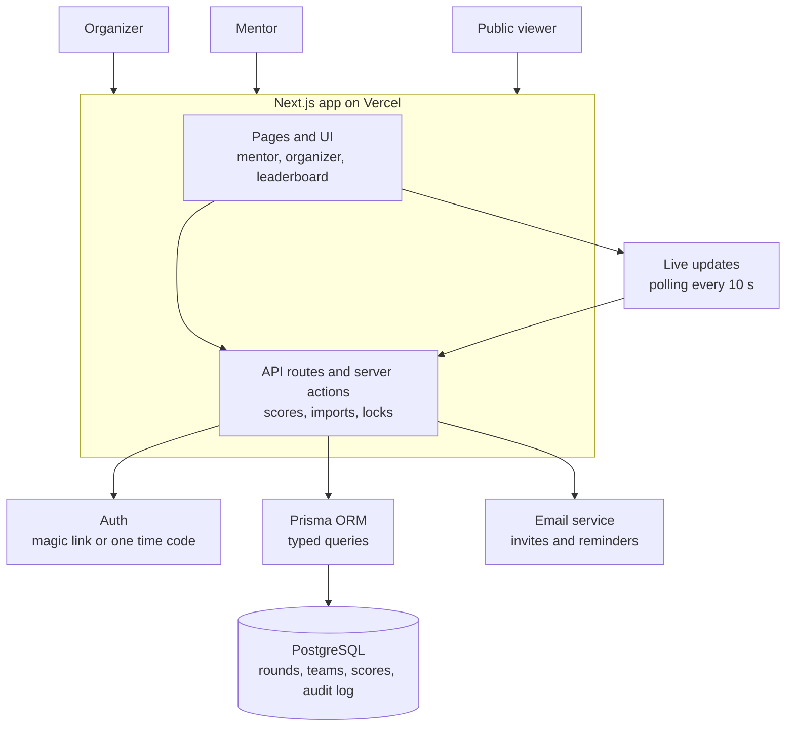
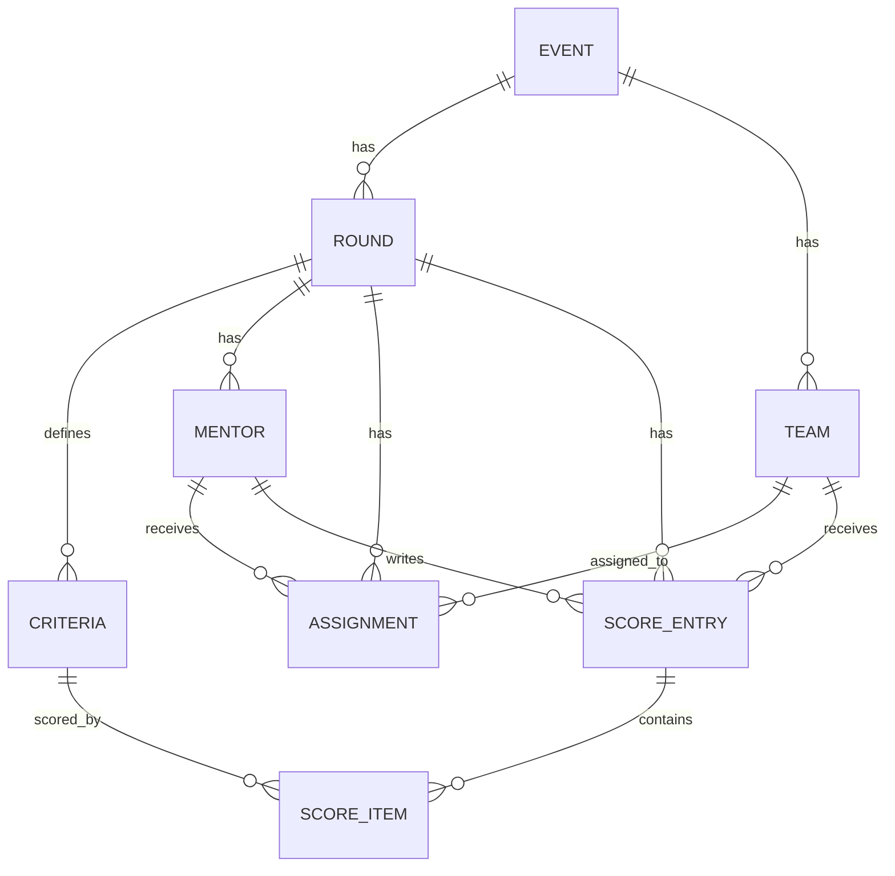

# Architecture

## 1. Tech stack

The main Hacker's Unity site is built on Next.js, so this tool uses the same stack.

| Layer | Choice |
| --- | --- |
| Frontend | Next.js (App Router), React, Tailwind CSS, shadcn/ui |
| Charts | Recharts |
| Backend | Next.js API routes and Server Actions |
| Database | PostgreSQL on Supabase (or Neon), accessed with Prisma ORM |
| Auth | Supabase Auth with magic link or one time code (NextAuth is the alternative) |
| File parsing | papaparse (CSV), SheetJS `xlsx` (Excel) |
| Live updates | Polling every 10 to 15 seconds (Supabase Realtime is an option later) |
| Email | Resend or SendGrid for invites and reminders |
| Hosting | Vercel |

## 2. Infrastructure workflow



## 3. Data model



Fields:

```
Event
└── Round        (id, event_id, name, status, max_total, scoring_mode)
    ├── Criteria     (id, round_id, name, description, max_score, weight, order)
    ├── Mentor       (id, round_id, name, email, phone, domain)
    ├── Team         (id, event_id, team_no, team_name, project_title, track, links)
    ├── Assignment   (id, round_id, mentor_id, team_id)
    └── ScoreEntry   (id, round_id, mentor_id, team_id, status, remarks,
                      total, submitted_at, updated_at)
        └── ScoreItem    (id, score_entry_id, criterion_id, value)

AuditLog (id, actor_id, action, entity, before, after, timestamp)
```

### Constraints

- Assignment is unique on `(round_id, mentor_id, team_id)`.
- `ScoreItem.value` must be between 0 and `Criteria.max_score`.
- A mentor can write a `ScoreEntry` only for teams they are assigned to.
- No edits after the round status is `LOCKED`, except by an admin (logged).

## 4. Auth and roles

One login method for everyone (magic link by email). Access depends on a role, not on a separate login system.

- **Admin (organizer):** full access.
- **Mentor:** only their own assigned teams.
- **Viewer:** no account. The public leaderboard is an open page, shown only when the organizer turns it on.

Design:

1. A `profiles` table links each Supabase user to a role (`admin` or `mentor`).
2. Login is invite only. Mentor accounts are created by the server when the organizer sends invites. The login page calls `signInWithOtp` with `shouldCreateUser: false`, so unknown emails get nothing.
3. The callback route `app/auth/callback/route.ts` exchanges the email link code for a session and redirects by role (`/admin` or `/mentor`).
4. The proxy file (`proxy.ts` in Next.js 16, `middleware.ts` in older versions) refreshes the session and redirects logged out users to `/login`.
5. A `requireRole()` helper runs on the server in every admin page and every server action. For mentors, a second check confirms the team belongs to them before any score is read or saved.

Prisma connects directly to the database and does not follow Supabase row-level security. The server side checks above are therefore required.

## 5. Route layout

```
app/
├── login/                  login page
├── auth/callback/          magic link callback
├── admin/                  organizer pages (role: admin)
│   ├── rounds/             round setup and criteria builder
│   ├── mentors/            sheet upload, manual add, assignments
│   ├── dashboard/          progress, scores table, charts
│   ├── leaderboard/        ranking and exports
│   └── audit/              audit log and settings
├── mentor/                 mentor pages (role: mentor)
│   └── teams/[teamId]/     scoring screen
└── leaderboard/            public page (only when enabled)
```

## 6. API sketch

| Method | Endpoint | Purpose |
| --- | --- | --- |
| POST | `/api/rounds` | Create a round |
| POST | `/api/rounds/:id/criteria` | Add or update criteria |
| POST | `/api/rounds/:id/mentors/import` | Upload a CSV or XLSX mentor sheet |
| POST | `/api/rounds/:id/mentors` | Add a mentor manually |
| PUT | `/api/rounds/:id/assignments` | Create or update assignments |
| GET | `/api/mentor/me/teams` | The mentor's assigned teams |
| POST | `/api/scores` | Save a draft or submit a score |
| GET | `/api/rounds/:id/leaderboard?top=10` | Ranked list |
| POST | `/api/rounds/:id/lock` | Lock the round |
| GET | `/api/rounds/:id/export?format=xlsx` | Export results |

## 7. Security and integrity

- Role based access control: mentors reach only their assigned teams.
- Mentors cannot see other mentors' scores (configurable).
- All score changes are written to the audit log.
- The round lock stops changes after judging closes.
- Rate limiting on auth and score endpoints.
- Data stays within the Hacker's Unity privacy policy and terms.
- Secrets live in `.env` files and Vercel environment variables, never in Git.
