# Phases

The plan is 22 working days in three releases. Tick a task here when it is finished and merged.

## Overview

```mermaid
flowchart LR
  subgraph V10[v1.0 MVP, Days 1 to 10]
    direction LR
    D1[Days 1 to 3<br/>Setup, schema, auth] --> D4[Days 4 to 6<br/>Round setup, upload, assignments]
    D4 --> D7[Day 7<br/>Mentor scoring]
    D7 --> D8[Day 8<br/>Organizer dashboard]
    D8 --> D9[Day 9<br/>Leaderboard, lock, audit]
    D9 --> D10[Day 10<br/>Testing and launch]
  end
  subgraph V11[v1.1, Days 11 to 16]
    direction LR
    A11[Multi mentor and averaging] --> B11[Normalization] --> C11[Reminders and PDF] --> R11[Release]
  end
  subgraph V20[v2.0, Days 17 to 22]
    direction LR
    A20[Multi round and judges] --> B20[AI summaries and public page] --> C20[Analytics] --> R20[Release]
  end
  V10 --> V11 --> V20
```

## Current status

- **Current day:** Day 1
- **Done:** Next.js app created in the repo and runs locally.
- **Next:** shadcn/ui, Supabase project, Prisma, Vercel deploy.
- **Docs:** this `brain/` folder (issue #1, assigned to Chinmay).

## v1.0 MVP (Days 1 to 10)

### Day 1: Project setup
- [x] Create the Next.js app (App Router) with Tailwind
- [ ] Add shadcn/ui
- [ ] Create the Postgres database on Supabase or Neon
- [ ] Install Prisma and connect it to the database
- [ ] Push to GitHub and deploy an empty app to Vercel

### Day 2: Database schema
- [ ] Write `schema.prisma` for Round, Criteria, Mentor, Team, Assignment, ScoreEntry, ScoreItem, AuditLog
- [ ] Add the unique rule on round, mentor, and team for assignments
- [ ] Run the first migration
- [ ] Write a seed script with the five default criteria and sample teams

### Day 3: Auth and roles
- [ ] Set up magic link login for mentors
- [ ] Add admin and mentor roles
- [ ] Protect routes so mentors only reach their own pages
- [ ] Build a simple login page and a logged out redirect

### Day 4: Round setup
- [ ] Build the create round form
- [ ] Build the criteria builder (name, description, max score, weight, order)
- [ ] Check that scores are numeric and within the max
- [ ] Add round status: Open, Paused, Locked

### Day 5: Mentor sheet upload
- [ ] Add the CSV and XLSX upload with papaparse and SheetJS
- [ ] Add the downloadable sample template
- [ ] Build the preview table with row level errors
- [ ] Import mentors and teams after the preview is approved

### Day 6: Assignments and invites
- [ ] Add manual mentor creation
- [ ] Assign teams by range, comma list, or multi select
- [ ] Show the validation summary (unassigned teams, duplicates, bad ranges)
- [ ] Send invite emails with Resend or SendGrid

### Day 7: Mentor scoring
- [ ] Build the mentor home with assigned teams, status, and progress bar
- [ ] Build the scoring screen with one input per criterion and a live total
- [ ] Add Save draft, Submit, and autosave
- [ ] Block mentors from teams they are not assigned to
- [ ] Make the layout mobile first with a sticky Submit button

### Day 8: Organizer dashboard
- [ ] Add overview cards (teams, mentors, submitted, pending, average)
- [ ] Add the mentor progress table with a Send reminder button
- [ ] Add the all scores table with sort and filter
- [ ] Add charts with Recharts
- [ ] Refresh data by polling every 10 to 15 seconds

### Day 9: Leaderboard, lock, audit
- [ ] Build the ranking with Top 10, 25, 50, 100, and All
- [ ] Add tie break rules in the set order
- [ ] Add CSV export
- [ ] Add the round lock and block edits after it
- [ ] Write every score change to the audit log

### Day 10: Testing and launch
- [ ] Run a full test round with 3 mentors and 27 teams
- [ ] Test on real phones
- [ ] Add rate limiting on login and score endpoints
- [ ] Check that mentors cannot see other mentors' scores
- [ ] Fix bugs, write a short organizer guide, and deploy

## v1.1 (Days 11 to 16)

### Day 11: Multiple mentors per team
- [ ] Add the setting for multiple mentors per team
- [ ] Change the assignment rule and warnings to match the setting
- [ ] Show all mentors on a team in the organizer views
- [ ] Let each mentor score the same team without seeing the others

### Day 12: Score averaging
- [ ] Calculate the final score as the average across mentors
- [ ] Show each mentor's score and the average on the leaderboard
- [ ] Decide how to handle a team where one mentor has not scored
- [ ] Update tie break rules for averaged scores

### Day 13: Normalization mode
- [ ] Add z-score and min-max normalization per mentor
- [ ] Add the mode switch in settings (raw is the default)
- [ ] Build the side by side view of raw and normalized rankings
- [ ] Test with one strict mentor and one lenient mentor

### Day 14: Reminders
- [ ] Improve email reminders for mentors with pending teams
- [ ] Choose a WhatsApp provider and add reminders
- [ ] Add scheduled reminders before the deadline
- [ ] Log every reminder that is sent

### Day 15: PDF reports and certificates
- [ ] Add the PDF result report
- [ ] Connect certificate generation for winners
- [ ] Add PDF to the export options with CSV and XLSX
- [ ] Check the layout of the PDF with long team names

### Day 16: Release v1.1
- [ ] Run a test round with 2 mentors per team
- [ ] Check normalization numbers by hand on a small sample
- [ ] Fix bugs and update the organizer guide
- [ ] Deploy v1.1

## v2.0 (Days 17 to 22)

### Day 17: Multi round support
- [ ] Add round order (Mentor Round, Semi-Final, Final)
- [ ] Let organizers move the top N teams to the next round
- [ ] Keep each round's scores separate
- [ ] Decide if mentors can see a team's earlier round scores

### Day 18: Judge panel rounds
- [ ] Add a judge role
- [ ] Build a panel round that runs next to a mentor round
- [ ] Reuse the criteria builder and scoring screen for judges
- [ ] Add judge scores to the leaderboard

### Day 19: AI feedback summaries
- [ ] Collect mentor remarks for each team
- [ ] Call the Claude API to write a short summary per team
- [ ] Let organizers review and edit before sharing
- [ ] Never send other mentors' names or scores to participants

### Day 20: Public results page
- [ ] Build a participant page for published results
- [ ] Add the organizer switch to publish or hide it
- [ ] Show rank and approved feedback only
- [ ] Test on mobile

### Day 21: Analytics across events
- [ ] Store results by event
- [ ] Build charts for scores and mentor averages over events
- [ ] Add filters by event and track
- [ ] Add an export for the analytics

### Day 22: Release v2.0
- [ ] Run a full multi round test event
- [ ] Check roles and access for mentors, judges, and viewers
- [ ] Run a security and rate limit check again
- [ ] Deploy v2.0 and update the guide
