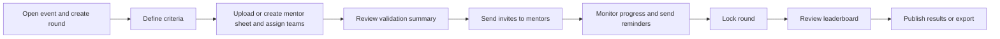
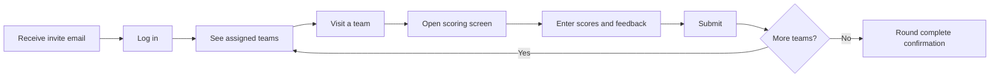
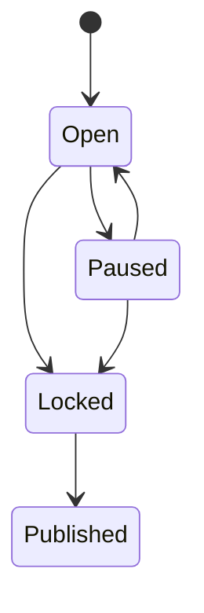

# Product Requirements: Mentor Round Scoring Tool

Version 1.0. Part of the Hacker's Unity Organizer Suite (hackersunity.com).
Source: Hacker's Unity Mentor Round Scoring Tool, Product Requirements and Build Spec v1.0.

## 1. Product vision

During a hackathon, the Mentor Round is where mentors visit assigned teams, review their progress, guide them, and give a score based on fixed criteria.

This tool lets organizers:

1. Create or upload a mentor sheet (which mentor is assigned to which teams).
2. Let each mentor see only their own teams and submit numeric scores per criterion.
3. Show every score on a live dashboard with a leaderboard (Top 10, Top 100, or custom).

**Goal:** Replace messy Google Sheets and WhatsApp updates with one fair, transparent, real-time mentor scoring system.

## 2. Users and roles

| Role | What they can do |
| --- | --- |
| Organizer (admin) | Create the round, define criteria, upload or create the mentor sheet, assign teams, view all scores, lock the round, publish results, export data |
| Mentor | Log in, see assigned teams, submit and edit scores and feedback until the round is locked |
| Viewer (optional) | Read-only access to the public leaderboard, only if the organizer turns it on. No account needed |

## 3. Core concepts

- **Round:** One mentor round in a hackathon (for example "Mentor Round 1").
- **Criteria:** Scoring parameters with a max score and an optional weight.
- **Mentor:** A person who evaluates teams.
- **Assignment:** A mapping of a mentor to a team or a team range.
- **Score entry:** One mentor's scores for one team in one round.
- **Leaderboard:** Teams ranked by total or weighted score.

## 4. Features

### 4.1 Mentor sheet setup

Organizers can build the mentor list in two ways.

**A. Upload a sheet**
- Formats: `.csv` and `.xlsx`.
- A sample template can be downloaded inside the tool.
- Preview and validate before importing.

Template (continuous team ranges):

| Mentor Name | Email | Team From | Team To |
| --- | --- | --- | --- |
| Mentor 1 | mentor1@example.com | 101 | 109 |
| Mentor 2 | mentor2@example.com | 110 | 118 |
| Mentor 3 | mentor3@example.com | 119 | 127 |

Template (non-continuous teams):

| Mentor Name | Email | Teams |
| --- | --- | --- |
| Mentor 1 | mentor1@example.com | 101, 105, 109, 113 |

**B. Create manually**
- Add a mentor (name, email, optional phone, expertise or domain).
- Assign teams by range (101 to 109), by comma separated list (101, 105, 109), or by multi select from the team list.
- Edit, reassign, or delete assignments any time before the round locks.

**Validation rules**
- Flag teams assigned to no mentor.
- Warn if a team has more than one mentor (allowed only if "multiple mentors per team" is on).
- Warn on duplicate emails and invalid ranges (for example 109 to 101).
- Show a summary such as "3 mentors, 27 teams, 0 unassigned".

### 4.2 Scoring criteria builder

Organizers define the criteria once per round.

| Field | Description |
| --- | --- |
| Criterion name | For example Innovation |
| Description | Short guidance shown to mentors |
| Max score | For example 10 |
| Weight (%) | Optional, defaults to equal weight |

Default criteria (editable):

| Criterion | Max score |
| --- | --- |
| Innovation and Idea | 10 |
| Technical Implementation | 10 |
| Problem Relevance and Impact | 10 |
| Progress Made | 10 |
| Presentation and Clarity | 10 |
| **Total** | **50** |

Organizers can add, remove, reorder, or change criteria. Scores are always numeric and checked against the max score.

### 4.3 Mentor dashboard

Login is by magic link or email plus one time code. A mentor sees:

- Their name and the round name.
- Only their assigned teams, each with a status: Pending, In Progress, or Scored.
- A progress bar (for example "6 / 9 teams scored").
- A search bar and a status filter.

**Scoring screen (per team)**
- Team name, number, project title, members, and links (GitHub, demo, slides) if available.
- One numeric input or slider per criterion, with min and max checks.
- A live total (for example "38 / 50").
- An optional feedback box.
- Save Draft and Submit buttons.

Mentors can edit until the organizer locks the round. Every edit is logged.

### 4.4 Organizer dashboard

- Overview cards: total teams, mentors, scores submitted, pending, average score.
- Mentor progress table: mentor, assigned teams, scored, pending, with a "Send reminder" button.
- All scores table, sortable and filterable by mentor, team, or criterion.
- Charts: score distribution, mentor-wise average (to spot strict or lenient mentors), and criterion-wise averages.
- Round controls: Open, Pause, Lock, Publish results.

### 4.5 Leaderboard

- Ranks all teams by total score (or weighted score).
- View options: Top 10, Top 25, Top 50, Top 100, or All.
- Columns: rank, team, mentor, criterion scores, total, percentage.
- Filter by track or domain if the hackathon has tracks.
- Tie-break rules, configurable and applied in this order:
  1. Highest score in a chosen criterion (for example Technical Implementation)
  2. Higher average across all criteria
  3. Earlier submission time
  4. Manual organizer decision
- Public leaderboard toggle (off by default). Mentors never see other mentors' scores unless allowed.
- Export to CSV, XLSX, or PDF.

### 4.6 Fairness and normalization (v1.1)

- **Raw mode (default):** scores are used as given.
- **Normalized mode:** z-score or min-max normalization per mentor before ranking.
- **Multi mentor averaging:** if each team is scored by two or more mentors, the final score is the average.
- A side by side view of raw and normalized rankings so organizers can decide.

## 5. User flows

### Organizer flow

### Mentor flow

### Round status

## 6. Example walkthrough

Setup: Mentor 1 has Teams 101 to 109, Mentor 2 has Teams 110 to 118, Mentor 3 has Teams 119 to 127.

Mentor 1 scores Team 104:

| Criterion | Score |
| --- | --- |
| Innovation and Idea | 8 / 10 |
| Technical Implementation | 7 / 10 |
| Problem Relevance and Impact | 9 / 10 |
| Progress Made | 6 / 10 |
| Presentation and Clarity | 8 / 10 |
| **Total** | **38 / 50** |

Leaderboard output:

| Rank | Team | Mentor | Total |
| --- | --- | --- | --- |
| 1 | Team 121 | Mentor 3 | 46 |
| 2 | Team 112 | Mentor 2 | 44 |
| 3 | Team 104 | Mentor 1 | 38 |

## 7. Edge cases

| Case | Behavior |
| --- | --- |
| Team has no mentor | Highlighted in the validation summary and dashboard |
| Mentor unavailable | Admin can reassign teams. Previous drafts are kept |
| Mentor skips a team | Shown as Pending. Excluded from ranking or flagged, based on a setting |
| Team withdrawn or disqualified | Admin can mark it inactive. Hidden from the mentor list and leaderboard |
| Partial scores | Cannot submit until all criteria are filled. Drafts are allowed |
| Tied totals | Resolved by the configured tie-break order |
| Wrong upload | Row-level errors are shown, with a download of an error report |

## 8. Roadmap

**MVP (v1.0)**
- Mentor sheet upload and manual creation
- Team assignment by range and list
- Criteria builder
- Mentor scoring screen
- Organizer dashboard
- Leaderboard (Top 10, 100, All) with CSV export
- Round lock

**v1.1**
- Multiple mentors per team with averaging
- Normalization mode
- Email and WhatsApp reminders
- PDF result report and certificates integration

**v2.0**
- Multi round support (Mentor Round, Semi-Final, Final)
- Judge panel rounds next to mentor rounds
- AI generated feedback summaries from mentor remarks
- Public result page for participants
- Analytics across events

## 9. Success metrics

- Time to set up a round: under 10 minutes.
- Score submission completion: 100% of assigned teams before the deadline.
- Zero scoring disputes caused by lost or edited data.
- Mentor satisfaction on ease of use: 4.5 out of 5 or better.
- Results published within 5 minutes of round lock.

## 10. Open questions

These come from the original spec. The proposed defaults are what the build plan assumes for v1.0 until the team decides otherwise. See `memory.md` for the decision log.

| Question | Proposed default for v1.0 |
| --- | --- |
| Is every team scored by one mentor or several? | One mentor per team. The Assignment table already allows more later |
| Should mentors see a team's previous round scores? | Decide before multi round work (v2.0) |
| Is the leaderboard public or organizer only? | Organizer only. Public toggle is off by default |
| Should teams be auto imported from Hacker's Unity registration data? | CSV import first. Direct integration later |
| Do organizers need custom weights per criterion for each track? | Equal weights. The weight field exists in the schema |
